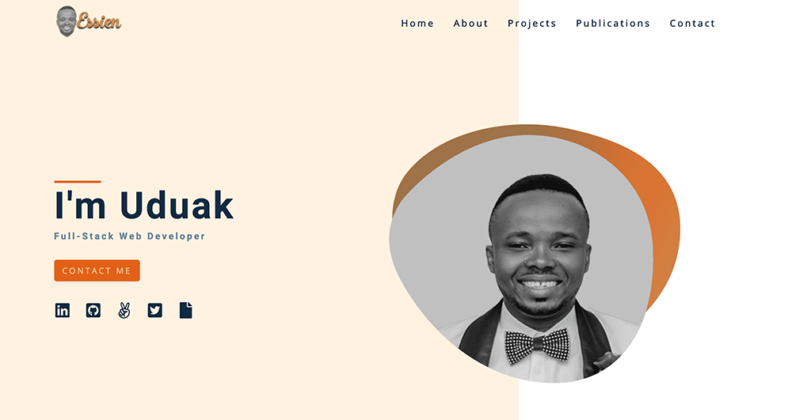

# Portfolio Page

The project is a complete design of my portfolio page

The design is based on a follow along tutorial of Gatsby - Strapi Portfolio Project. If you like it you can follow along as well to build your using [same tutorial](https://www.youtube.com/watch?v=asB-dUwpH4Y).



## Built With

- HTML
- CSS
- Gatsby
- Strapi

## Live Demo
[Live Demo Link](http://uduakessien.com)

## Getting Started

```bash
 git clone https://github.com/acushlakoncept/portfolio.git

 cd portfolio

 npm install

 npm start
```

If you intend to use the project for your portfolio, you should note that it uses Strapi as its API server
Navigate to the [repo](https://github.com/acushlakoncept/portfolio-api), clone it and run `npm run develop` to get started.


Build for Production

```bash
 gatsby clean && gatsby build
```

After gatsby has successfully build the project, copy the public directory content to your host for deployment.


## Author

**Uduak Essien**

- Github: [@acushlakoncept](https://github.com/acushlakoncept/)
- Twitter: [@acushlakoncept](https://twitter.com/acushlakoncept)
- Linkedin: [acushlakoncept](https://www.linkedin.com/in/acushlakoncept/)

## 🤝 Contributing

Contributions, issues and feature requests are welcome!

Feel free to check the [issues page](https://github.com/acushlakoncept/portfolio/issues).

## Show your support

Give a ⭐️ if you like this project!
